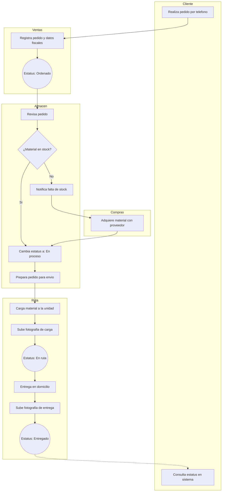
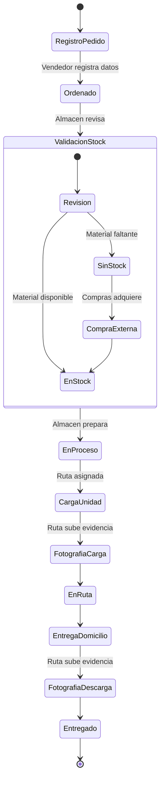
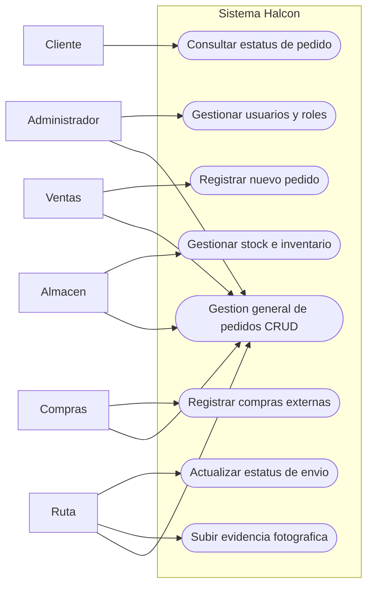
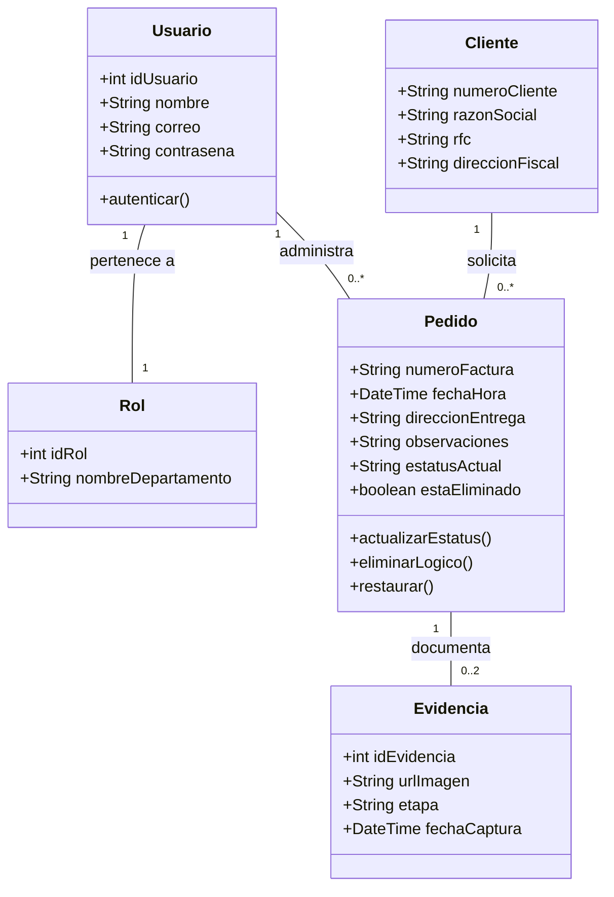
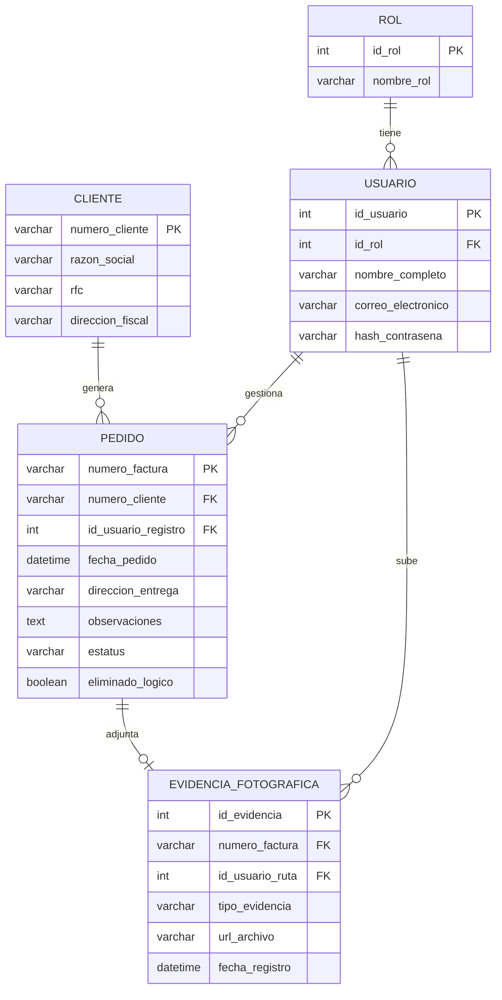

# Proyecto Halcon - Sistema de Gestion de Pedidos

## Informacion del Estudiante
* **Nombre completo:** Brayan Eleazar Villegas Navarro
* **Matricula:** Al03091719
* **Carrera:** IDS (Ingenieria en Desarrollo de Software)
* **Semestre:** 6
* **Materia:** Aplicaciones web
* **Profesor:** Cristopher Gerardo Gaytan Diaz

---

## 1. Descripcion del Proyecto
Aplicacion web desarrollada para "Halcon", una distribuidora de materiales de construccion. Este sistema automatiza los procesos internos de venta, almacen y distribucion, permitiendo a los clientes rastrear el estatus de sus pedidos en tiempo real y visualizar evidencias fotograficas de sus entregas.

## 2. Metodologia de Trabajo
**Seleccion:** Metodologia Agil - Scrum.

**Justificacion:**
Para el desarrollo de la plataforma de Halcon, Scrum es la metodologia idonea debido a la naturaleza modular de los requerimientos. Al dividir el proyecto en Sprints (iteraciones cortas), se pueden entregar modulos funcionales de forma incremental. Esto permite estructurar el desarrollo separando la logica de autenticacion y roles, la gestion del inventario y el flujo logistico de las entregas. Esta adaptabilidad garantiza que el software siempre este alineado con la logica de negocio de la distribuidora y permite integrar cambios o mejoras sin afectar los modulos ya terminados.

## 3. Diagramas del Sistema

### 3.1 Diagrama BPMN (Logica de Negocio)

### 3.2 Diagrama de Actividades (Ciclo de vida del pedido)

### 3.3 Diagrama de Casos de Uso

### 3.4 Diagrama de Clases

### 3.5 Diagrama Entidad-Relacion (ER)

## 4. Reflexion Personal
El analisis e interpretacion del caso de la distribuidora Halcon me permitio comprender la importancia de traducir las reglas de negocio en un diseño arquitectonico solido antes de escribir codigo. Identificar correctamente los actores y limitar sus permisos a traves de un control de acceso basado en roles garantiza la seguridad y la integridad de las operaciones diarias de la empresa.

Adicionalmente, el diseño de la base de datos aplicando eliminacion logica para los pedidos protege el historial de la informacion y evita errores criticos en auditorias o consultas futuras. La elaboracion de los diagramas (BPMN, Clases, Casos de Uso, Actividades y ER) me facilito visualizar como interactuan las diferentes partes del sistema, desde que el cliente llama hasta que se entrega el material con su respectiva evidencia, asegurando que se cubran al cien por ciento los requerimientos establecidos en el planteamiento inicial.
